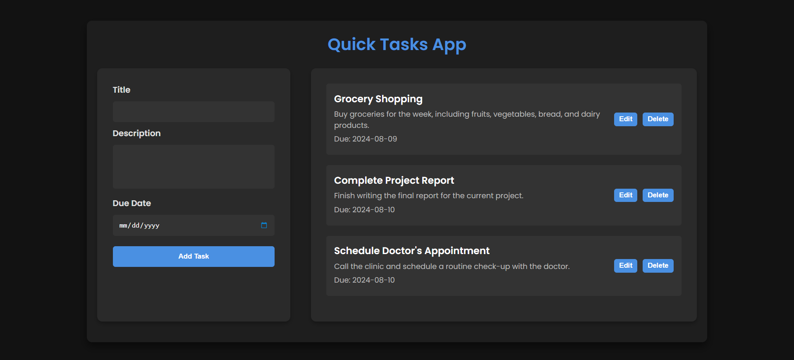

# quick-tasks-app

A task management application that allows users to create, view, edit, and delete tasks in a simple and organized interface.

## Table of Contents

- [Introduction](#introduction)
- [Features](#features)
- [Screenshots](#screenshots)

## Introduction

The **quick-tasks-app** is a lightweight and efficient task management tool designed to help users keep track of their to-dos. Built with HTML, CSS, and JavaScript, the app provides a user-friendly interface for adding, viewing, editing, and deleting tasks. It aims to enhance productivity by making task management simple and intuitive.

## Features

- **Task Creation**: Users can add new tasks by filling out a form with details such as title, description, and due date. Each task is displayed in a list with all relevant information.

- **Task Display**: The app includes a function that iterates over the task array and displays each task in a visually appealing list format. This makes it easy for users to see their tasks at a glance.

- **Task Editing**: Users can update existing tasks by clicking the "Edit" button next to a task. This populates the form with the task's current details, allowing users to make changes and save them.

- **Task Deletion**: Each task has a "Delete" button that allows users to remove the task from the list. The app includes a confirmation dialog to prevent accidental deletions.

## Screenshots

  
_interface for adding, viewing, editing, and deleting tasks_
